OcActState 派生
==========================

[OcActState_Pl](OcActState_Pl.md) は別途。

下記表は[TestUtility](../TestUtility/README.md)を使用して抽出しています。

| 名前空間 | クラス     | 基本クラス   |       |  
|----------|------------|--------------|-------|  
| Oc | OcActState  | Object    | abstract  |  
| Oc | AS_Idle  |     |   |  
| Oc | AS_KnockBack  |     |   |  
| Oc | OcActState_Pl  |     | abstract  |  
| Oc.Em | OcActState_Em  |     | abstract  |  
| Oc.Em | AsEm_TerritoryChecker  | OcActState_Em    | abstract  |  
| Oc.Em | AsEm_TurnToTerritory  | OcActState_Em    |   |  
| Oc.Em | AsEm_CharmFollow  | OcActState_Em    |   |  
| Oc.Em | AsEm_CaptureWait  | OcActState_Em    |   |  
| Oc.Em | AsEm_Hit  | OcActState_Em    |   |  
| Oc.Em | AsEm_Knockback  | OcActState_Em    |   |  
| Oc.Em | AsEm_BlowAwayBase  | OcActState_Em    | abstract  |  
| Oc.Em | AsEm_BlowAway  | AsEm_BlowAwayBase    |   |  
| Oc.Em | AsEm_AttackOrder  | AsEm_BlowAwayBase    |   |  
| Oc.Em | AsEm_Floating  | OcActState_Em    |   |  
| Oc.Em | AsEm_EmConstToBldgBase  | AsEm_TerritoryChecker    | abstract  |  
| Oc.Em | AsEm_StockFarm  | AsEm_EmConstToBldgBase    |   |  
| Oc.Em | AsEm_Generator  | AsEm_EmConstToBldgBase    |   |  
| Oc.Em | AsEm_Balloon  | AsEm_TerritoryChecker    |   |  
| Oc.Em | AsEm_CannonWait  | OcActState_Em    |   |  
| Oc.Em | AsEm_CannonShoot  | OcActState_Em    |   |  
| Oc.Em | AsEm_ShieldBash  | AsEm_BlowAwayBase    |   |  
| Oc.Em | AsEm_Walk  | AsEm_TerritoryChecker    |   |  
| Oc.Em | AsEm_Run  | AsEm_TerritoryChecker    |   |  
| Oc.Em | AsEm_Wander  | AsEm_TerritoryChecker    |   |  
| Oc.Em | AsEm_Idle  | OcActState_Em    |   |  
| Oc.Em | AsEm_MoveToTgtBase  | AsEm_TerritoryChecker    | abstract  |  
| Oc.Em | AsEm_Stun  | OcActState_Em    |   |  
| Oc.Em | AsEm_Death  | OcActState_Em    |   |  
| Oc.Em | AsEm_DeathExplosion  | OcActState_Em    |   |  
| Oc.Em | AsEm_Deactivate  | OcActState_Em    |   |  
| Oc.Em | AsEm_Frozen  | OcActState_Em    |   |  
| Oc.Em | AsBarrel  | OcActState_Em    | abstract  |  
| Oc.Em | AsBarrel_Idle  | OcActState_Em    |   |  
| Oc.Em | AsFixedArtillery_Fire_Idle  | AsBarrel_Idle    |   |  
| Oc.Em | AsEm_CircleTargetDeath  | OcActState_Em    |   |  
| Oc.Em | AS_PursuitQueen  | OcActState_Em    |   |  
| Oc.Em | AS_Attack_TurnPl  | OcActState_Em    |   |  
| Oc.Em | AS_Attack_Dash  | OcActState_Em    |   |  
| Oc.Em | AsBear  | AsEm_TerritoryChecker    | abstract  |  
| Oc.Em | AsBear_WalkNear  | AsEm_MoveToTgtBase    |   |  
| Oc.Em | AsBear_RunNear  | AsEm_MoveToTgtBase    |   |  
| Oc.Em | AsBear_Roar  | AsBear    |   |  
| Oc.Em | AsBear_AtkBite  | AsBear    |   |  
| Oc.Em | AsBear_AtkPunchR  | AsBear    |   |  
| Oc.Em | AsBear_AtkPunchL  | AsBear    |   |  
| Oc.Em | AsBear_AtkJumpStart  | AsBear    |   |  
| Oc.Em | AsBear_AtkJumpLoop  | AsBear    |   |  
| Oc.Em | AsBear_AtkJumpEnd  | AsBear    |   |  
| Oc.Em | AsBear_AtkEat  | AsBear    |   |  
| Oc.Em | AsBear_StandRoar  | AsBear    |   |  
| Oc.Em | AsBird_DeathFall  | AsEm_Death    |   |  
| Oc.Em | AsBird  | OcActState_Em    | abstract  |  
| Oc.Em | AsBird_ToLand  | AsBird    |   |  
| Oc.Em | AsBird_ToFly  | AsBird    |   |  
| Oc.Em | AsBird_FlyWander  | AsBird    |   |  
| Oc.Em | AsBird_LandIdle  | AsBird    |   |  
| Oc.Em | AsBird_Hit  | AsBird    |   |  
| Oc.Em | AsBird_HitFly  | AsBird    |   |  
| Oc.Em | AsBoar  | AsEm_TerritoryChecker    | abstract  |  
| Oc.Em | AsBoar_SpinTarget  | AsBoar    |   |  
| Oc.Em | AsBoar_AtkRun  | AsBoar    |   |  
| Oc.Em | AsBuffalo  | AsEm_TerritoryChecker    | abstract  |  
| Oc.Em | AsBuffalo_AtkRunEnd  | AsBuffalo    |   |  
| Oc.Em | AsBuffalo_AtkRun  | AsBuffalo    |   |  
| Oc.Em | AsCamel  | AsEm_TerritoryChecker    | abstract  |  
| Oc.Em | AsCamel_AtkBase  | AsCamel    | abstract  |  
| Oc.Em | AsCamel_AtkFront  | AsCamel_AtkBase    |   |  
| Oc.Em | AsCamel_AtkSwing  | AsCamel_AtkBase    |   |  
| Oc.Em | AsCamel_AtkBack  | AsCamel_AtkBase    |   |  
| Oc.Em | AsChicken  | AsEm_TerritoryChecker    | abstract  |  
| Oc.Em | AsChicken_WalkAway  | AsEm_MoveToTgtBase    |   |  
| Oc.Em | AsChicken_RunAway  | AsEm_MoveToTgtBase    |   |  
| Oc.Em | AsChicken_AtkRun  | AsChicken    |   |  
| Oc.Em | AsCow  | AsEm_TerritoryChecker    | abstract  |  
| Oc.Em | AsCow_AtkRush  | AsEm_Run    |   |  
| Oc.Em | AsCrocodile  | AsEm_TerritoryChecker    | abstract  |  
| Oc.Em | AsCrocodile_WalkBack  | AsCrocodile    |   |  
| Oc.Em | AsCrocodile_Wait  | AsCrocodile    |   |  
| Oc.Em | AsCrocodile_AtkBiteBase  | AsCrocodile    | abstract  |  
| Oc.Em | AsCrocodile_AtkBiteUp  | AsCrocodile_AtkBiteBase    |   |  
| Oc.Em | AsCrocodile_AtkBite  | AsCrocodile_AtkBiteBase    |   |  
| Oc.Em | AsDragon  | AsEm_TerritoryChecker    | abstract  |  
| Oc.Em | AsDragon_StunFromL  | AsDragon    |   |  
| Oc.Em | AsDragon_Turn2Pl  | AsDragon    |   |  
| Oc.Em | AsDragon_AttackJump  | AsDragon    |   |  
| Oc.Em | AsEm_HeadAttackBase  | AsDragon    |   |  
| Oc.Em | AsDragon_AttackR  | AsEm_HeadAttackBase    |   |  
| Oc.Em | AsDragon_AttackL  | AsEm_HeadAttackBase    |   |  
| Oc.Em | AsDragon_AttackF  | AsEm_HeadAttackBase    |   |  
| Oc.Em | AsDragon_AttackSwing  | AsEm_HeadAttackBase    |   |  
| Oc.Em | AsDragon_BreathSwing  | AsDragon    |   |  
| Oc.Em | AsDragon_BreathSpecial  | AsDragon    |   |  
| Oc.Em | AsDragon_FireBall  | AsDragon    |   |  
| Oc.Em | AsDragon_TailSwing  | AsDragon    |   |  
| Oc.Em | AsDragon_Stump  | AsDragon    |   |  
| Oc.Em | AsDragon_AttackWind  | AsDragon    |   |  
| Oc.Em | AsDragon_Run  | AsDragon    |   |  
| Oc.Em | AsDragon_Sleep  | AsDragon    |   |  
| Oc.Em | AsDragon_Provoke  | AsDragon    |   |  
| Oc.Em | AsDragon_LandToFly  | AsDragon    |   |  
| Oc.Em | AsEm_FlyMoveBase  | AsDragon    |   |  
| Oc.Em | AsDragon_FlyMoveToPl  | AsEm_FlyMoveBase    |   |  
| Oc.Em | AsDragon_FlyMoveAwayPl  | AsEm_FlyMoveBase    |   |  
| Oc.Em | AsEm_FlyIdle  | AsDragon    |   |  
| Oc.Em | AsDragon_FlyFireBall  | AsDragon    |   |  
| Oc.Em | AsDragon_FlyToLand  | AsDragon    |   |  
| Oc.Em | AsElephant  | AsEm_TerritoryChecker    | abstract  |  
| Oc.Em | AsElephant_AtkFront  | AsElephant    |   |  
| Oc.Em | AsElephant_RunToPl  | AsElephant    |   |  
| Oc.Em | AsFrameWalker  | AsEm_TerritoryChecker    | abstract  |  
| Oc.Em | AsGiraffe  | AsEm_TerritoryChecker    | abstract  |  
| Oc.Em | AsGiraffe_FightIdle  | AsGiraffe    |   |  
| Oc.Em | AsGiraffe_AtkHead  | AsGiraffe    |   |  
| Oc.Em | AsGiraffe_AtkLegFront  | AsGiraffe    |   |  
| Oc.Em | AsGiraffe_AtkLegBack  | AsGiraffe    |   |  
| Oc.Em | AsGiraffe_SleepStart  | AsGiraffe    |   |  
| Oc.Em | AsGiraffe_SleepLoop  | AsGiraffe    |   |  
| Oc.Em | AsGiraffe_SleepEnd  | AsGiraffe    |   |  
| Oc.Em | AsGiraffe_DrinkStart  | AsGiraffe    |   |  
| Oc.Em | AsGiraffe_DrinkLoop  | AsGiraffe    |   |  
| Oc.Em | AsGiraffe_DrinkEnd  | AsGiraffe    |   |  
| Oc.Em | AsGiraffe_WalkToTree  | AsGiraffe    |   |  
| Oc.Em | AsGiraffe_WalkToDrink  | AsGiraffe    |   |  
| Oc.Em | AsGiraffe_Eat  | AsGiraffe    |   |  
| Oc.Em | AsGiraffe_RunToPl  | AsGiraffe    |   |  
| Oc.Em | AsGoblinBird  | AsEm_TerritoryChecker    | abstract  |  
| Oc.Em | AsGoblinBird_JumpStart  | AsGoblinBird    |   |  
| Oc.Em | AsGoblinBird_JumpLoop  | AsGoblinBird    |   |  
| Oc.Em | AsGoblinBird_Fall  | AsGoblinBird    |   |  
| Oc.Em | AsGoblinBird_Glider  | AsGoblinBird    |   |  
| Oc.Em | AsGoblinHunter_DrawArrow  | AsEm_TerritoryChecker    |   |  
| Oc.Em | AsGoblinHunter_Atk_Shoot  | AsEm_TerritoryChecker    |   |  
| Oc.Em | AsGoblinHunter_SearchShootingPos  | AsEm_MoveToTgtBase    |   |  
| Oc.Em | AsGoblinSharman  | AsEm_TerritoryChecker    | abstract  |  
| Oc.Em | AsGoblin_Atk1_Shoot  | AsGoblinSharman    |   |  
| Oc.Em | AsGoblin_Atk2_Melee  | AsGoblinSharman    |   |  
| Oc.Em | AsGoblin_ShootAfterRunToPl  | AsEm_MoveToTgtBase    |   |  
| Oc.Em | AsGoblin_ShootAfterRunToFriend  | AsEm_MoveToTgtBase    |   |  
| Oc.Em | AsGoblinWarrior  | AsEm_TerritoryChecker    | abstract  |  
| Oc.Em | AsGoblin_AtkCombo1  | AsGoblinWarrior    |   |  
| Oc.Em | AsGoblin_AtkCombo2  | AsGoblinWarrior    |   |  
| Oc.Em | AsGoblin_AtkSlash  | AsGoblinWarrior    |   |  
| Oc.Em | AsGoblin_Provoke  | AsGoblinWarrior    |   |  
| Oc.Em | AsGoblin_BackstepStart  | AsGoblinWarrior    |   |  
| Oc.Em | AsGoblin_BackstepLoop  | AsGoblinWarrior    |   |  
| Oc.Em | AsGoblin_BackstepEnd  | AsGoblinWarrior    |   |  
| Oc.Em | AsGoblin_RunToPlAround  | AsEm_MoveToTgtBase    |   |  
| Oc.Em | AsGoblin_WalkToAttack  | AsEm_MoveToTgtBase    |   |  
| Oc.Em | AsGolemAncient  | AsEm_TerritoryChecker    | abstract  |  
| Oc.Em | AsGolemAncient_AttackSwing  | AsGolemAncient    |   |  
| Oc.Em | AsGolemAncient_JumpAttack  | AsGolemAncient    |   |  
| Oc.Em | AsGolemAncient_WalkToAttack  | AsEm_MoveToTgtBase    |   |  
| Oc.Em | AsGolemAncient_TackleStart  | AsGolemAncient    |   |  
| Oc.Em | AsGolemAncient_TackleLoop  | AsGolemAncient    |   |  
| Oc.Em | AsGolemAncient_TackleEnd  | AsGolemAncient    |   |  
| Oc.Em | AsGolemAncient_LaserStart  | AsGolemAncient    |   |  
| Oc.Em | AsGolemAncient_LaserLoop  | AsGolemAncient    |   |  
| Oc.Em | AsGolemAncient_LaserShotStart  | AsGolemAncient    |   |  
| Oc.Em | AsGolemAncient_LaserShotLoop  | AsGolemAncient    |   |  
| Oc.Em | AsGolemAncient_LaserShotEnd  | AsGolemAncient    |   |  
| Oc.Em | AsGolemAncient_TackleStunStart  | AsGolemAncient    |   |  
| Oc.Em | AsGolemAncient_TackleStunEnd  | AsGolemAncient    |   |  
| Oc.Em | AsGolemStone  | AsEm_TerritoryChecker    | abstract  |  
| Oc.Em | AsGolemStone_WalkToAttack  | AsEm_MoveToTgtBase    |   |  
| Oc.Em | AsGolemStone_Spin_Base  | AsGolemStone    | abstract  |  
| Oc.Em | AsGolemStone_Spin_Attack_Punch_R  | AsGolemStone_Spin_Base    |   |  
| Oc.Em | AsGolemStone_Spin_Attack_Punch_L  | AsGolemStone_Spin_Base    |   |  
| Oc.Em | AsGolemStone_Spin_Attack_Throw  | AsGolemStone_Spin_Base    |   |  
| Oc.Em | AsGolemStone_Attack_Punch_R  | AsGolemStone    |   |  
| Oc.Em | AsGolemStone_Attack_Punch_L  | AsGolemStone    |   |  
| Oc.Em | AsGolemStone_Attack_Stamp  | AsGolemStone    |   |  
| Oc.Em | AsGolemStone_Attack_Throw  | AsGolemStone    |   |  
| Oc.Em | AsGolemStone_Attack_ManyThrow_Start  | AsGolemStone    |   |  
| Oc.Em | AsGolemStone_Attack_ManyThrow_Loop  | AsGolemStone    |   |  
| Oc.Em | AsGolemStone_Attack_ManyThrow_End  | AsGolemStone    |   |  
| Oc.Em | AsGolemStone_Attack_Spin  | AsGolemStone    |   |  
| Oc.Em | AsGolemStone_Spawn  | AsGolemStone    |   |  
| Oc.Em | AsGolemStone_RockMode  | AsGolemStone    |   |  
| Oc.Em | AsGolemStone_Despawn  | OcActState_Em    |   |  
| Oc.Em | AsCow  | AsEm_TerritoryChecker    | abstract  |  
| Oc.Em | AsCow_Rush  | AsEm_Run    |   |  
| Oc.Em | As_Lizardman  | AsEm_TerritoryChecker    | abstract  |  
| Oc.Em | As_AtkNormal  | As_Lizardman    |   |  
| Oc.Em | As_AtkJump_Start  | As_Lizardman    |   |  
| Oc.Em | As_AtkJump_Loop  | As_Lizardman    |   |  
| Oc.Em | As_AtkJump_End  | As_Lizardman    |   |  
| Oc.Em | As_AtkSpining  | As_Lizardman    |   |  
| Oc.Em | As_Provoke  | As_Lizardman    |   |  
| Oc.Em | As_RunToPlAround  | AsEm_MoveToTgtBase    |   |  
| Oc.Em | As_WalkToAttack  | AsEm_MoveToTgtBase    |   |  
| Oc.Em | AsWolf  | AsEm_TerritoryChecker    | abstract  |  
| Oc.Em | AsWolf_Dodge  | AsWolf    |   |  
| Oc.Em | AsWolf_Hawl  | AsWolf    |   |  
| Oc.Em | AsWolf_Run2Pl  | AsWolf    |   |  
| Oc.Em | AsEm_AttackJumpBase  | AsWolf    |   |  
| Oc.Em | AsWolf_AttackJump  | AsEm_AttackJumpBase    |   |  
| Oc.Em | AsWolf_AttackJab  | AsWolf    |   |  
| Oc.Em | AsWolf_Provoke  | AsWolf    |   |  
| Oc.Em | AsWolf_Run  | AsWolf    |   |  
| Oc.Em | AsWolf_WalkCircle  | AsWolf    |   |  
| Oc.Em | AsEm_Idle  | AsWolf    |   |  
| Oc.Em | AsWolf_Sleep  | AsWolf    |   |  
| Oc.Em | AS_Lumberjack  | AsEm_TerritoryChecker    | abstract  |  
| Oc.Em | AsLumberjack_Idle  | AS_Lumberjack    |   |  
| Oc.Em | AsLumberjack_SimpleMove  | AS_Lumberjack    |   |  
| Oc.Em | AsLumberjack_JumpFront  | AS_Lumberjack    |   |  
| Oc.Em | AsLumberjack_Turn  | AS_Lumberjack    |   |  
| Oc.Em | AsMono  | AsEm_TerritoryChecker    | abstract  |  
| Oc.Em | AsMono_Idle  | AsEm_Idle    |   |  
| Oc.Em | AsMono_Atk  | AsMono    |   |  
| Oc.Em | AsNPC  | OcActState_Em    | abstract  |  
| Oc.Em | AsNPC_RunAway  | AsEm_Run    |   |  
| Oc.Em | AsNPC_Talk_Base  | AsNPC    | abstract  |  
| Oc.Em | AsNPC_Talk_Once  | AsNPC_Talk_Base    |   |  
| Oc.Em | AsNPC_Talk_Loop  | AsNPC_Talk_Base    |   |  
| Oc.Em | AS_SimpleMoveSlow  | AsEm_TerritoryChecker    |   |  
| Oc.Em | AS_Wander  | AsEm_TerritoryChecker    |   |  
| Oc.Em | AsPvMonster  | AsEm_TerritoryChecker    | abstract  |  
| Oc.Em | AsPvMonster_PvAct0  | OcActState_Em    |   |  
| Oc.Em | AsPvMonster_PvAct1  | OcActState_Em    |   |  
| Oc.Em | AsRide  | OcActState_Em    | abstract  |  
| Oc.Em | AsRide_RideIdle  | OcActState_Em    |   |  
| Oc.Em | AS_SimpleMove  | AsEm_TerritoryChecker    |   |  
| Oc.Em | AS_SimpleMoveSlow  | AsEm_TerritoryChecker    |   |  
| Oc.Em | AS_Wander  | AsEm_TerritoryChecker    |   |  
| Oc.Em | AS_Attack_TurnPl  | AsEm_TerritoryChecker    |   |  
| Oc.Em | AS_Attack_Dash  | AsEm_TerritoryChecker    |   |  

```mermaid
classDiagram

	class OcActState{
	}


	OcActState <|-- AS_Idle
	class AS_Idle{
	}


	OcActState <|-- AS_KnockBack
	class AS_KnockBack{
	}


	OcActState <|-- OcActState_Pl
	class OcActState_Pl{
	}


	OcActState <|-- OcActState_Em
	class OcActState_Em{
	}


	OcActState_Em <|-- AsEm_TerritoryChecker
	class AsEm_TerritoryChecker{
	}


	OcActState_Em <|-- AsEm_TurnToTerritory
	class AsEm_TurnToTerritory{
	}


	OcActState_Em <|-- AsEm_CharmFollow
	class AsEm_CharmFollow{
	}


	OcActState_Em <|-- AsEm_CaptureWait
	class AsEm_CaptureWait{
	}


	OcActState_Em <|-- AsEm_Hit
	class AsEm_Hit{
	}


	OcActState_Em <|-- AsEm_Knockback
	class AsEm_Knockback{
	}


	OcActState_Em <|-- AsEm_BlowAwayBase
	class AsEm_BlowAwayBase{
	}


	AsEm_BlowAwayBase <|-- AsEm_BlowAway
	class AsEm_BlowAway{
	}


	AsEm_BlowAwayBase <|-- AsEm_AttackOrder
	class AsEm_AttackOrder{
	}


	OcActState_Em <|-- AsEm_Floating
	class AsEm_Floating{
	}


	AsEm_TerritoryChecker <|-- AsEm_EmConstToBldgBase
	class AsEm_EmConstToBldgBase{
	}


	AsEm_EmConstToBldgBase <|-- AsEm_StockFarm
	class AsEm_StockFarm{
	}


	AsEm_EmConstToBldgBase <|-- AsEm_Generator
	class AsEm_Generator{
	}


	AsEm_TerritoryChecker <|-- AsEm_Balloon
	class AsEm_Balloon{
	}


	OcActState_Em <|-- AsEm_CannonWait
	class AsEm_CannonWait{
	}


	OcActState_Em <|-- AsEm_CannonShoot
	class AsEm_CannonShoot{
	}


	AsEm_BlowAwayBase <|-- AsEm_ShieldBash
	class AsEm_ShieldBash{
	}


	AsEm_TerritoryChecker <|-- AsEm_Walk
	class AsEm_Walk{
	}


	AsEm_TerritoryChecker <|-- AsEm_Run
	class AsEm_Run{
	}


	AsEm_TerritoryChecker <|-- AsEm_Wander
	class AsEm_Wander{
	}


	OcActState_Em <|-- AsEm_Idle
	class AsEm_Idle{
	}


	AsEm_TerritoryChecker <|-- AsEm_MoveToTgtBase
	class AsEm_MoveToTgtBase{
	}


	OcActState_Em <|-- AsEm_Stun
	class AsEm_Stun{
	}


	OcActState_Em <|-- AsEm_Death
	class AsEm_Death{
	}


	OcActState_Em <|-- AsEm_DeathExplosion
	class AsEm_DeathExplosion{
	}


	OcActState_Em <|-- AsEm_Deactivate
	class AsEm_Deactivate{
	}


	OcActState_Em <|-- AsEm_Frozen
	class AsEm_Frozen{
	}


	OcActState_Em <|-- AsBarrel
	class AsBarrel{
	}


	OcActState_Em <|-- AsBarrel_Idle
	class AsBarrel_Idle{
	}


	AsBarrel_Idle <|-- AsFixedArtillery_Fire_Idle
	class AsFixedArtillery_Fire_Idle{
	}


	OcActState_Em <|-- AsEm_CircleTargetDeath
	class AsEm_CircleTargetDeath{
	}


	OcActState_Em <|-- AS_PursuitQueen
	class AS_PursuitQueen{
	}


	OcActState_Em <|-- AS_Attack_TurnPl
	class AS_Attack_TurnPl{
	}


	OcActState_Em <|-- AS_Attack_Dash
	class AS_Attack_Dash{
	}


	AsEm_TerritoryChecker <|-- AsBear
	class AsBear{
	}


	AsEm_MoveToTgtBase <|-- AsBear_WalkNear
	class AsBear_WalkNear{
	}


	AsEm_MoveToTgtBase <|-- AsBear_RunNear
	class AsBear_RunNear{
	}


	AsBear <|-- AsBear_Roar
	class AsBear_Roar{
	}


	AsBear <|-- AsBear_AtkBite
	class AsBear_AtkBite{
	}


	AsBear <|-- AsBear_AtkPunchR
	class AsBear_AtkPunchR{
	}


	AsBear <|-- AsBear_AtkPunchL
	class AsBear_AtkPunchL{
	}


	AsBear <|-- AsBear_AtkJumpStart
	class AsBear_AtkJumpStart{
	}


	AsBear <|-- AsBear_AtkJumpLoop
	class AsBear_AtkJumpLoop{
	}


	AsBear <|-- AsBear_AtkJumpEnd
	class AsBear_AtkJumpEnd{
	}


	AsBear <|-- AsBear_AtkEat
	class AsBear_AtkEat{
	}


	AsBear <|-- AsBear_StandRoar
	class AsBear_StandRoar{
	}


	AsEm_Death <|-- AsBird_DeathFall
	class AsBird_DeathFall{
	}


	OcActState_Em <|-- AsBird
	class AsBird{
	}


	AsBird <|-- AsBird_ToLand
	class AsBird_ToLand{
	}


	AsBird <|-- AsBird_ToFly
	class AsBird_ToFly{
	}


	AsBird <|-- AsBird_FlyWander
	class AsBird_FlyWander{
	}


	AsBird <|-- AsBird_LandIdle
	class AsBird_LandIdle{
	}


	AsBird <|-- AsBird_Hit
	class AsBird_Hit{
	}


	AsBird <|-- AsBird_HitFly
	class AsBird_HitFly{
	}


	AsEm_TerritoryChecker <|-- AsBoar
	class AsBoar{
	}


	AsBoar <|-- AsBoar_SpinTarget
	class AsBoar_SpinTarget{
	}


	AsBoar <|-- AsBoar_AtkRun
	class AsBoar_AtkRun{
	}


	AsEm_TerritoryChecker <|-- AsBuffalo
	class AsBuffalo{
	}


	AsBuffalo <|-- AsBuffalo_AtkRunEnd
	class AsBuffalo_AtkRunEnd{
	}


	AsBuffalo <|-- AsBuffalo_AtkRun
	class AsBuffalo_AtkRun{
	}


	AsEm_TerritoryChecker <|-- AsCamel
	class AsCamel{
	}


	AsCamel <|-- AsCamel_AtkBase
	class AsCamel_AtkBase{
	}


	AsCamel_AtkBase <|-- AsCamel_AtkFront
	class AsCamel_AtkFront{
	}


	AsCamel_AtkBase <|-- AsCamel_AtkSwing
	class AsCamel_AtkSwing{
	}


	AsCamel_AtkBase <|-- AsCamel_AtkBack
	class AsCamel_AtkBack{
	}


	AsEm_TerritoryChecker <|-- AsChicken
	class AsChicken{
	}


	AsEm_MoveToTgtBase <|-- AsChicken_WalkAway
	class AsChicken_WalkAway{
	}


	AsEm_MoveToTgtBase <|-- AsChicken_RunAway
	class AsChicken_RunAway{
	}


	AsChicken <|-- AsChicken_AtkRun
	class AsChicken_AtkRun{
	}


	AsEm_TerritoryChecker <|-- AsCow
	class AsCow{
	}


	AsEm_Run <|-- AsCow_AtkRush
	class AsCow_AtkRush{
	}


	AsEm_TerritoryChecker <|-- AsCrocodile
	class AsCrocodile{
	}


	AsCrocodile <|-- AsCrocodile_WalkBack
	class AsCrocodile_WalkBack{
	}


	AsCrocodile <|-- AsCrocodile_Wait
	class AsCrocodile_Wait{
	}


	AsCrocodile <|-- AsCrocodile_AtkBiteBase
	class AsCrocodile_AtkBiteBase{
	}


	AsCrocodile_AtkBiteBase <|-- AsCrocodile_AtkBiteUp
	class AsCrocodile_AtkBiteUp{
	}


	AsCrocodile_AtkBiteBase <|-- AsCrocodile_AtkBite
	class AsCrocodile_AtkBite{
	}


	AsEm_TerritoryChecker <|-- AsDragon
	class AsDragon{
	}


	AsDragon <|-- AsDragon_StunFromL
	class AsDragon_StunFromL{
	}


	AsDragon <|-- AsDragon_Turn2Pl
	class AsDragon_Turn2Pl{
	}


	AsDragon <|-- AsDragon_AttackJump
	class AsDragon_AttackJump{
	}


	AsDragon <|-- AsEm_HeadAttackBase
	class AsEm_HeadAttackBase{
	}


	AsEm_HeadAttackBase <|-- AsDragon_AttackR
	class AsDragon_AttackR{
	}


	AsEm_HeadAttackBase <|-- AsDragon_AttackL
	class AsDragon_AttackL{
	}


	AsEm_HeadAttackBase <|-- AsDragon_AttackF
	class AsDragon_AttackF{
	}


	AsEm_HeadAttackBase <|-- AsDragon_AttackSwing
	class AsDragon_AttackSwing{
	}


	AsDragon <|-- AsDragon_BreathSwing
	class AsDragon_BreathSwing{
	}


	AsDragon <|-- AsDragon_BreathSpecial
	class AsDragon_BreathSpecial{
	}


	AsDragon <|-- AsDragon_FireBall
	class AsDragon_FireBall{
	}


	AsDragon <|-- AsDragon_TailSwing
	class AsDragon_TailSwing{
	}


	AsDragon <|-- AsDragon_Stump
	class AsDragon_Stump{
	}


	AsDragon <|-- AsDragon_AttackWind
	class AsDragon_AttackWind{
	}


	AsDragon <|-- AsDragon_Run
	class AsDragon_Run{
	}


	AsDragon <|-- AsDragon_Sleep
	class AsDragon_Sleep{
	}


	AsDragon <|-- AsDragon_Provoke
	class AsDragon_Provoke{
	}


	AsDragon <|-- AsDragon_LandToFly
	class AsDragon_LandToFly{
	}


	AsDragon <|-- AsEm_FlyMoveBase
	class AsEm_FlyMoveBase{
	}


	AsEm_FlyMoveBase <|-- AsDragon_FlyMoveToPl
	class AsDragon_FlyMoveToPl{
	}


	AsEm_FlyMoveBase <|-- AsDragon_FlyMoveAwayPl
	class AsDragon_FlyMoveAwayPl{
	}


	AsDragon <|-- AsEm_FlyIdle
	class AsEm_FlyIdle{
	}


	AsDragon <|-- AsDragon_FlyFireBall
	class AsDragon_FlyFireBall{
	}


	AsDragon <|-- AsDragon_FlyToLand
	class AsDragon_FlyToLand{
	}


	AsEm_TerritoryChecker <|-- AsElephant
	class AsElephant{
	}


	AsElephant <|-- AsElephant_AtkFront
	class AsElephant_AtkFront{
	}


	AsElephant <|-- AsElephant_RunToPl
	class AsElephant_RunToPl{
	}


	AsEm_TerritoryChecker <|-- AsFrameWalker
	class AsFrameWalker{
	}


	AsEm_TerritoryChecker <|-- AsGiraffe
	class AsGiraffe{
	}


	AsGiraffe <|-- AsGiraffe_FightIdle
	class AsGiraffe_FightIdle{
	}


	AsGiraffe <|-- AsGiraffe_AtkHead
	class AsGiraffe_AtkHead{
	}


	AsGiraffe <|-- AsGiraffe_AtkLegFront
	class AsGiraffe_AtkLegFront{
	}


	AsGiraffe <|-- AsGiraffe_AtkLegBack
	class AsGiraffe_AtkLegBack{
	}


	AsGiraffe <|-- AsGiraffe_SleepStart
	class AsGiraffe_SleepStart{
	}


	AsGiraffe <|-- AsGiraffe_SleepLoop
	class AsGiraffe_SleepLoop{
	}


	AsGiraffe <|-- AsGiraffe_SleepEnd
	class AsGiraffe_SleepEnd{
	}


	AsGiraffe <|-- AsGiraffe_DrinkStart
	class AsGiraffe_DrinkStart{
	}


	AsGiraffe <|-- AsGiraffe_DrinkLoop
	class AsGiraffe_DrinkLoop{
	}


	AsGiraffe <|-- AsGiraffe_DrinkEnd
	class AsGiraffe_DrinkEnd{
	}


	AsGiraffe <|-- AsGiraffe_WalkToTree
	class AsGiraffe_WalkToTree{
	}


	AsGiraffe <|-- AsGiraffe_WalkToDrink
	class AsGiraffe_WalkToDrink{
	}


	AsGiraffe <|-- AsGiraffe_Eat
	class AsGiraffe_Eat{
	}


	AsGiraffe <|-- AsGiraffe_RunToPl
	class AsGiraffe_RunToPl{
	}


	AsEm_TerritoryChecker <|-- AsGoblinBird
	class AsGoblinBird{
	}


	AsGoblinBird <|-- AsGoblinBird_JumpStart
	class AsGoblinBird_JumpStart{
	}


	AsGoblinBird <|-- AsGoblinBird_JumpLoop
	class AsGoblinBird_JumpLoop{
	}


	AsGoblinBird <|-- AsGoblinBird_Fall
	class AsGoblinBird_Fall{
	}


	AsGoblinBird <|-- AsGoblinBird_Glider
	class AsGoblinBird_Glider{
	}


	AsEm_TerritoryChecker <|-- AsGoblinHunter_DrawArrow
	class AsGoblinHunter_DrawArrow{
	}


	AsEm_TerritoryChecker <|-- AsGoblinHunter_Atk_Shoot
	class AsGoblinHunter_Atk_Shoot{
	}


	AsEm_MoveToTgtBase <|-- AsGoblinHunter_SearchShootingPos
	class AsGoblinHunter_SearchShootingPos{
	}


	AsEm_TerritoryChecker <|-- AsGoblinSharman
	class AsGoblinSharman{
	}


	AsGoblinSharman <|-- AsGoblin_Atk1_Shoot
	class AsGoblin_Atk1_Shoot{
	}


	AsGoblinSharman <|-- AsGoblin_Atk2_Melee
	class AsGoblin_Atk2_Melee{
	}


	AsEm_MoveToTgtBase <|-- AsGoblin_ShootAfterRunToPl
	class AsGoblin_ShootAfterRunToPl{
	}


	AsEm_MoveToTgtBase <|-- AsGoblin_ShootAfterRunToFriend
	class AsGoblin_ShootAfterRunToFriend{
	}


	AsEm_TerritoryChecker <|-- AsGoblinWarrior
	class AsGoblinWarrior{
	}


	AsGoblinWarrior <|-- AsGoblin_AtkCombo1
	class AsGoblin_AtkCombo1{
	}


	AsGoblinWarrior <|-- AsGoblin_AtkCombo2
	class AsGoblin_AtkCombo2{
	}


	AsGoblinWarrior <|-- AsGoblin_AtkSlash
	class AsGoblin_AtkSlash{
	}


	AsGoblinWarrior <|-- AsGoblin_Provoke
	class AsGoblin_Provoke{
	}


	AsGoblinWarrior <|-- AsGoblin_BackstepStart
	class AsGoblin_BackstepStart{
	}


	AsGoblinWarrior <|-- AsGoblin_BackstepLoop
	class AsGoblin_BackstepLoop{
	}


	AsGoblinWarrior <|-- AsGoblin_BackstepEnd
	class AsGoblin_BackstepEnd{
	}


	AsEm_MoveToTgtBase <|-- AsGoblin_RunToPlAround
	class AsGoblin_RunToPlAround{
	}


	AsEm_MoveToTgtBase <|-- AsGoblin_WalkToAttack
	class AsGoblin_WalkToAttack{
	}


	AsEm_TerritoryChecker <|-- AsGolemAncient
	class AsGolemAncient{
	}


	AsGolemAncient <|-- AsGolemAncient_AttackSwing
	class AsGolemAncient_AttackSwing{
	}


	AsGolemAncient <|-- AsGolemAncient_JumpAttack
	class AsGolemAncient_JumpAttack{
	}


	AsEm_MoveToTgtBase <|-- AsGolemAncient_WalkToAttack
	class AsGolemAncient_WalkToAttack{
	}


	AsGolemAncient <|-- AsGolemAncient_TackleStart
	class AsGolemAncient_TackleStart{
	}


	AsGolemAncient <|-- AsGolemAncient_TackleLoop
	class AsGolemAncient_TackleLoop{
	}


	AsGolemAncient <|-- AsGolemAncient_TackleEnd
	class AsGolemAncient_TackleEnd{
	}


	AsGolemAncient <|-- AsGolemAncient_LaserStart
	class AsGolemAncient_LaserStart{
	}


	AsGolemAncient <|-- AsGolemAncient_LaserLoop
	class AsGolemAncient_LaserLoop{
	}


	AsGolemAncient <|-- AsGolemAncient_LaserShotStart
	class AsGolemAncient_LaserShotStart{
	}


	AsGolemAncient <|-- AsGolemAncient_LaserShotLoop
	class AsGolemAncient_LaserShotLoop{
	}


	AsGolemAncient <|-- AsGolemAncient_LaserShotEnd
	class AsGolemAncient_LaserShotEnd{
	}


	AsGolemAncient <|-- AsGolemAncient_TackleStunStart
	class AsGolemAncient_TackleStunStart{
	}


	AsGolemAncient <|-- AsGolemAncient_TackleStunEnd
	class AsGolemAncient_TackleStunEnd{
	}


	AsEm_TerritoryChecker <|-- AsGolemStone
	class AsGolemStone{
	}


	AsEm_MoveToTgtBase <|-- AsGolemStone_WalkToAttack
	class AsGolemStone_WalkToAttack{
	}


	AsGolemStone <|-- AsGolemStone_Spin_Base
	class AsGolemStone_Spin_Base{
	}


	AsGolemStone_Spin_Base <|-- AsGolemStone_Spin_Attack_Punch_R
	class AsGolemStone_Spin_Attack_Punch_R{
	}


	AsGolemStone_Spin_Base <|-- AsGolemStone_Spin_Attack_Punch_L
	class AsGolemStone_Spin_Attack_Punch_L{
	}


	AsGolemStone_Spin_Base <|-- AsGolemStone_Spin_Attack_Throw
	class AsGolemStone_Spin_Attack_Throw{
	}


	AsGolemStone <|-- AsGolemStone_Attack_Punch_R
	class AsGolemStone_Attack_Punch_R{
	}


	AsGolemStone <|-- AsGolemStone_Attack_Punch_L
	class AsGolemStone_Attack_Punch_L{
	}


	AsGolemStone <|-- AsGolemStone_Attack_Stamp
	class AsGolemStone_Attack_Stamp{
	}


	AsGolemStone <|-- AsGolemStone_Attack_Throw
	class AsGolemStone_Attack_Throw{
	}


	AsGolemStone <|-- AsGolemStone_Attack_ManyThrow_Start
	class AsGolemStone_Attack_ManyThrow_Start{
	}


	AsGolemStone <|-- AsGolemStone_Attack_ManyThrow_Loop
	class AsGolemStone_Attack_ManyThrow_Loop{
	}


	AsGolemStone <|-- AsGolemStone_Attack_ManyThrow_End
	class AsGolemStone_Attack_ManyThrow_End{
	}


	AsGolemStone <|-- AsGolemStone_Attack_Spin
	class AsGolemStone_Attack_Spin{
	}


	AsGolemStone <|-- AsGolemStone_Spawn
	class AsGolemStone_Spawn{
	}


	AsGolemStone <|-- AsGolemStone_RockMode
	class AsGolemStone_RockMode{
	}


	OcActState_Em <|-- AsGolemStone_Despawn
	class AsGolemStone_Despawn{
	}


	AsEm_TerritoryChecker <|-- AsCow
	class AsCow{
	}


	AsEm_Run <|-- AsCow_Rush
	class AsCow_Rush{
	}


	AsEm_TerritoryChecker <|-- As_Lizardman
	class As_Lizardman{
	}


	As_Lizardman <|-- As_AtkNormal
	class As_AtkNormal{
	}


	As_Lizardman <|-- As_AtkJump_Start
	class As_AtkJump_Start{
	}


	As_Lizardman <|-- As_AtkJump_Loop
	class As_AtkJump_Loop{
	}


	As_Lizardman <|-- As_AtkJump_End
	class As_AtkJump_End{
	}


	As_Lizardman <|-- As_AtkSpining
	class As_AtkSpining{
	}


	As_Lizardman <|-- As_Provoke
	class As_Provoke{
	}


	AsEm_MoveToTgtBase <|-- As_RunToPlAround
	class As_RunToPlAround{
	}


	AsEm_MoveToTgtBase <|-- As_WalkToAttack
	class As_WalkToAttack{
	}


	AsEm_TerritoryChecker <|-- AsWolf
	class AsWolf{
	}


	AsWolf <|-- AsWolf_Dodge
	class AsWolf_Dodge{
	}


	AsWolf <|-- AsWolf_Hawl
	class AsWolf_Hawl{
	}


	AsWolf <|-- AsWolf_Run2Pl
	class AsWolf_Run2Pl{
	}


	AsWolf <|-- AsEm_AttackJumpBase
	class AsEm_AttackJumpBase{
	}


	AsEm_AttackJumpBase <|-- AsWolf_AttackJump
	class AsWolf_AttackJump{
	}


	AsWolf <|-- AsWolf_AttackJab
	class AsWolf_AttackJab{
	}


	AsWolf <|-- AsWolf_Provoke
	class AsWolf_Provoke{
	}


	AsWolf <|-- AsWolf_Run
	class AsWolf_Run{
	}


	AsWolf <|-- AsWolf_WalkCircle
	class AsWolf_WalkCircle{
	}


	AsWolf <|-- AsEm_Idle
	class AsEm_Idle{
	}


	AsWolf <|-- AsWolf_Sleep
	class AsWolf_Sleep{
	}


	AsEm_TerritoryChecker <|-- AS_Lumberjack
	class AS_Lumberjack{
	}


	AS_Lumberjack <|-- AsLumberjack_Idle
	class AsLumberjack_Idle{
	}


	AS_Lumberjack <|-- AsLumberjack_SimpleMove
	class AsLumberjack_SimpleMove{
	}


	AS_Lumberjack <|-- AsLumberjack_JumpFront
	class AsLumberjack_JumpFront{
	}


	AS_Lumberjack <|-- AsLumberjack_Turn
	class AsLumberjack_Turn{
	}


	AsEm_TerritoryChecker <|-- AsMono
	class AsMono{
	}


	AsEm_Idle <|-- AsMono_Idle
	class AsMono_Idle{
	}


	AsMono <|-- AsMono_Atk
	class AsMono_Atk{
	}


	OcActState_Em <|-- AsNPC
	class AsNPC{
	}


	AsEm_Run <|-- AsNPC_RunAway
	class AsNPC_RunAway{
	}


	AsNPC <|-- AsNPC_Talk_Base
	class AsNPC_Talk_Base{
	}


	AsNPC_Talk_Base <|-- AsNPC_Talk_Once
	class AsNPC_Talk_Once{
	}


	AsNPC_Talk_Base <|-- AsNPC_Talk_Loop
	class AsNPC_Talk_Loop{
	}


	AsEm_TerritoryChecker <|-- AS_SimpleMoveSlow
	class AS_SimpleMoveSlow{
	}


	AsEm_TerritoryChecker <|-- AS_Wander
	class AS_Wander{
	}


	AsEm_TerritoryChecker <|-- AsPvMonster
	class AsPvMonster{
	}


	OcActState_Em <|-- AsPvMonster_PvAct0
	class AsPvMonster_PvAct0{
	}


	OcActState_Em <|-- AsPvMonster_PvAct1
	class AsPvMonster_PvAct1{
	}


	OcActState_Em <|-- AsRide
	class AsRide{
	}


	OcActState_Em <|-- AsRide_RideIdle
	class AsRide_RideIdle{
	}


	AsEm_TerritoryChecker <|-- AS_SimpleMove
	class AS_SimpleMove{
	}


	AsEm_TerritoryChecker <|-- AS_SimpleMoveSlow
	class AS_SimpleMoveSlow{
	}


	AsEm_TerritoryChecker <|-- AS_Wander
	class AS_Wander{
	}


	AsEm_TerritoryChecker <|-- AS_Attack_TurnPl
	class AS_Attack_TurnPl{
	}


	AsEm_TerritoryChecker <|-- AS_Attack_Dash
	class AS_Attack_Dash{
	}

```

