OcActState_Pl 派生
==========================

OcActState_Pl は OcActState から派生。  

下記表は[TestUtility](../TestUtility/README.md)を使用して抽出しています。

| 名前空間 | クラス     | 基本クラス   |       |  
|----------|------------|--------------|-------|  
| Oc | OcActState_Pl  | OcActState    | abstract  |  
| Oc | AsPl_MovementBase  |     | abstract  |  
| Oc | AsPl_MovementBaseStrafe  | AsPl_MovementBase    |   |  
| Oc | AsPl_MovementBasicAction  | AsPl_MovementBase    |   |  
| Oc | AsPl_MovementStand  | AsPl_MovementBasicAction    |   |  
| Oc | AsPl_MovementFatigue  | AsPl_MovementBasicAction    |   |  
| Oc | AsPl_MovementSwim  | AsPl_MovementBasicAction    |   |  
| Oc | AsPl_MovementCrouch  | AsPl_MovementBasicAction    |   |  
| Oc | AsPl_MovementBow  | AsPl_MovementBaseStrafe    |   |  
| Oc | AsPl_MovementGuard  | AsPl_MovementBaseStrafe    |   |  
| Oc | AsPl_SprintBase  |     | abstract  |  
| Oc | AsPl_Sprint  | AsPl_SprintBase    |   |  
| Oc | AsPl_SprintEnd  |     |   |  
| Oc | AsPl_SprintSwim  | AsPl_SprintBase    |   |  
| Oc | AsPl_StartShield  |     |   |  
| Oc | AsPl_GuardLoop  |     |   |  
| Oc | AsPl_StartSword  |     |   |  
| Oc | AsPl_StartSwordShield  |     |   |  
| Oc | AsPl_StartBow  |     |   |  
| Oc | AsPl_RunBlock  |     |   |  
| Oc | AsPl_Knockback  |     |   |  
| Oc | AsPl_HipDown  |     |   |  
| Oc | AsPl_BlowAwayStart  |     |   |  
| Oc | AsPl_BlowAwayStart2  |     |   |  
| Oc | AsPl_BlowAwayLoop  |     |   |  
| Oc | AsPl_BlowAwayLoop2  |     |   |  
| Oc | AsPl_BlowAwayLand  |     |   |  
| Oc | AsPl_BlowAwayUp  |     |   |  
| Oc | AsPl_KnockBackGuard  |     |   |  
| Oc | AsPl_Roll  |     |   |  
| Oc | AsPl_CannonWait  |     |   |  
| Oc | AsPl_CannonShoot  |     |   |  
| Oc | AsPl_JumpBase  |     | abstract  |  
| Oc | AsPl_JumpBasic  | AsPl_JumpBase    | abstract  |  
| Oc | AsPl_Jump  | AsPl_JumpBasic    |   |  
| Oc | AsPl_RideJump  | AsPl_JumpBasic    |   |  
| Oc | AsPl_RideEmergency  | AsPl_JumpBasic    |   |  
| Oc | AsPl_ThinkStart  | AsPl_SimpleBase    |   |  
| Oc | AsPl_ThinkLoop  | AsPl_SimpleBase    |   |  
| Oc | AsPl_ThinkEnd  | AsPl_SimpleBase    |   |  
| Oc | AsPl_AirJump  | AsPl_JumpBasic    |   |  
| Oc | AsPl_AirDash  | AsPl_JumpBasic    |   |  
| Oc | AsPl_AirJumpBow  | AsPl_JumpBasic    |   |  
| Oc | AsPl_WallJump  | AsPl_JumpBase    |   |  
| Oc | AsPl_FallBase  |     |   |  
| Oc | AsPl_Fall  | AsPl_FallBase    |   |  
| Oc | AsPl_BowLoopInAirBase  | AsPl_FallBase    |   |  
| Oc | AsPl_BowLoopInAir  | AsPl_BowLoopInAirBase    |   |  
| Oc | AsPl_BowShotInAir  | AsPl_BowLoopInAirBase    |   |  
| Oc | AsPl_DiveFall  |     |   |  
| Oc | AsPl_JumpKick  |     |   |  
| Oc | AsPl_JumpSwordStart  |     |   |  
| Oc | AsPl_JumpSwordLoop  |     |   |  
| Oc | AsPl_JumpSwordLand  |     |   |  
| Oc | AsPl_Glider  |     |   |  
| Oc | AsPl_Jetpack  |     |   |  
| Oc | AsPl_Climb  |     |   |  
| Oc | AsPl_Relic_Dash  |     |   |  
| Oc | AsPl_SimpleBase  |     | abstract  |  
| Oc | AsPl_Land  | AsPl_SimpleBase    |   |  
| Oc | AsPl_LandWalk  | AsPl_SimpleBase    |   |  
| Oc | AsPl_LandSprint  | AsPl_SimpleBase    |   |  
| Oc | AsPl_LandHigh  | AsPl_SimpleBase    |   |  
| Oc | AsPl_SuperHeroLand  | AsPl_SimpleBase    |   |  
| Oc | AsPl_Emote  | AsPl_SimpleBase    |   |  
| Oc | AsPl_RideStand  | AsPl_SimpleBase    |   |  
| Oc | AsPl_Slip  | AsPl_SimpleBase    |   |  
| Oc | AsPl_StandUpBack  | AsPl_SimpleBase    |   |  
| Oc | AsPl_StandUpFront  | AsPl_SimpleBase    |   |  
| Oc | AsPl_FishingStart  |     |   |  
| Oc | AsPl_FishingLoop  |     |   |  
| Oc | AsPl_FishingSuccess  |     |   |  
| Oc | AsPl_FishingCancel  |     |   |  
| Oc | AsPl_WpOn  |     |   |  
| Oc | AsPl_WpOff  |     |   |  
| Oc | AsPl_WpAttackBase  |     | abstract  |  
| Oc | AsPl_AttackAxe  | AsPl_WpAttackBase    |   |  
| Oc | AsPl_AttackTorchTwoHand  | AsPl_WpAttackBase    |   |  
| Oc | AsPl_AttackShield  | AsPl_WpAttackBase    |   |  
| Oc | AsPl_AttackDashShield  | AsPl_WpAttackBase    |   |  
| Oc | AsPl_AttackPickel  | AsPl_WpAttackBase    |   |  
| Oc | AsPl_AttackSwordBase  | AsPl_WpAttackBase    | abstract  |  
| Oc | AttackDashStartSword  | AsPl_AttackSwordBase    |   |  
| Oc | AsPl_AttackSword0  | AsPl_AttackSwordBase    |   |  
| Oc | AsPl_AttackSword1  | AsPl_AttackSwordBase    |   |  
| Oc | AsPl_AttackSword2  | AsPl_AttackSwordBase    |   |  
| Oc | AsPl_AttackSwordChargeStart  | AsPl_AttackSwordBase    |   |  
| Oc | AsPl_AttackSwordChargeLoop  | AsPl_AttackSwordBase    |   |  
| Oc | AsPl_AttackSwordChargeEnd  | AsPl_AttackSwordBase    |   |  
| Oc | AsPl_TH_Attack0  | AsPl_WpAttackBase    |   |  
| Oc | AsPl_TH_Attack1  | AsPl_WpAttackBase    |   |  
| Oc | AsPl_TH_Attack2  | AsPl_WpAttackBase    |   |  
| Oc | AsPl_TH_ChargeStart  | AsPl_SimpleBase    |   |  
| Oc | AsPl_TH_ChargeLoop  | AsPl_WpAttackBase    |   |  
| Oc | AsPl_TH_ChargeEnd  | AsPl_SimpleBase    |   |  
| Oc | AsPl_TH_DashAttack0  | AsPl_WpAttackBase    |   |  
| Oc | AsPl_TH_DashAttack1  | AsPl_WpAttackBase    |   |  
| Oc | AsPl_Resurrected  |     |   |  
| Oc | AsPl_AttackHammer  | AsPl_WpAttackBase    |   |  
| Oc | AsPl_AttackTorch  |     |   |  
| Oc | AsPl_AttackBucketEmpty  |     |   |  
| Oc | AsPl_ThrowBase  |     |   |  
| Oc | AsPl_ThrowShoot  | AsPl_ThrowBase    |   |  
| Oc | AsPl_Bucket  | AsPl_ThrowBase    |   |  
| Oc | AsPl_Seed  | AsPl_ThrowBase    |   |  
| Oc | AsPl_Pickup  |     |   |  
| Oc | AsPl_Bounce  | AsPl_SimpleBase    |   |  
| Oc | AsPl_SpinSlashStart  |     |   |  
| Oc | AsPl_SpinSlashLoop  |     |   |  
| Oc | AsPl_SpinSlashEnd  |     |   |  
| Oc | AsPl_SpinSlashFinishAttack  |     |   |  
| Oc | AsPl_Put  | AsPl_SimpleBase    |   |  
| Oc | AsPl_Craft  | AsPl_SimpleBase    |   |  
| Oc | AsPl_Craft_FromInventory  | AsPl_SimpleBase    |   |  
| Oc | AsPl_Craft_FromInventory_Success  | AsPl_SimpleBase    |   |  
| Oc | AsPl_Drink  | AsPl_SimpleBase    |   |  
| Oc | AsPl_Eat  | AsPl_SimpleBase    |   |  
| Oc | AsPl_Summon  |     |   |  
| Oc | AsPl_Bow  |     |   |  
| Oc | AsPl_PunchBase  |     | abstract  |  
| Oc | AsPl_Punch1  | AsPl_PunchBase    |   |  
| Oc | AsPl_Punch2  | AsPl_PunchBase    |   |  
| Oc | AsPl_Kick  |     |   |  
| Oc | AsPl_Death  |     |   |  
| Oc | AsPl_Respawn  |     |   |  
| Oc | AsPl_WarpStart  |     |   |  
| Oc | AsPl_WarpEnd  |     |   |  
| Oc | AsPl_Skill_ComboStrike  |     |   |  
| Oc | AsPl_Skill_Thunder  |     |   |  
| Oc | AsPl_Skill_PetAttack  |     |   |  
| Oc | AsPl_Skill_Taunt  |     |   |  
| Oc | AsPl_Skill_GenericBuff  |     |   |  
| Oc | AsPl_Skill_GenericItemGet  |     |   |  
| Oc | AsPl_Skill_CureCond  |     |   |  
| Oc | AsPl_Skill_BuffCri  |     |   |  
| Oc | AsPl_Skill_ShieldRun  |     |   |  
| Oc | AsPl_Skill_ShieldRunEnd  |     |   |  
| Oc | AsPl_Skill_JumpFallStrikeStart  |     |   |  
| Oc | AsPl_Skill_JumpFallStrikeLoop  |     |   |  
| Oc | AsPl_Skill_JumpFallStrikeEnd  |     |   |  
| Oc | AsPl_Skill_BowSniping  |     |   |  
| Oc | AsPl_Skill_MultiWay  |     |   |  
| Oc | AsPl_Skill_BowCombo  |     |   |  
| Oc | AsPl_Skill_Gatling  |     |   |  
| Oc | AsPl_Skill_Guillotine  |     |   |  
| Oc | AsPl_Skill_MoveSpeedUp  |     |   |  
| Oc | AsPl_Skill_Stealth  |     |   |  
| Oc | AsPl_Skill_Resurrection  |     |   |  
| Oc | AsPl_Skill_FakeDeath  |     |   |  
| Oc | AsPl_Skill_FakeDeathEnd  |     |   |  
| Oc | AsPl_Skill_Siphone  |     |   |  
| Oc | AsPl_Skill_Heal  |     |   |  
| Oc | AsPl_Skill_Blaze  |     |   |  
| Oc | AsPl_Skill_BlazeEnd  |     |   |  
| Oc | AsPl_Skill_HitMoney  |     |   |  
| Oc | AsPl_Skill_PetBomb  |     |   |  
| Oc | AsPl_Skill_IceBeam  |     |   |  
| Oc | AsPl_Skill_IceBeamEnd  |     |   |  
| Oc | AsPl_Skill_IaiCombo  |     |   |  
| Oc | AsPl_Skill_Slash  |     |   |  
| Oc | AsPl_Skill_Meteo  |     |   |  
| Oc | AsPl_Skill_WindEdge  |     |   |  
| Oc | AsPl_Skill_SwordDance  |     |   |  
| Oc | AsPl_Skill_SwordTornado  |     |   |  
| Oc | AsPl_Skill_SwordTornadoEnd  |     |   |  
| Oc | AsPl_Skill_Explosion  |     |   |  
| Oc | AsPl_Skill_IceCrystal  |     |   |  
| Oc | AsPl_Skill_IaiSlash  |     |   |  
| Oc | AsPl_Skill_TimeStop  |     |   |  
| Oc | AsPl_Skill_AreaHeal  |     |   |  
| Oc | AsPl_Skill_WarSong  |     |   |  
| Oc | AsPl_Skill_HyperResurrection  |     |   |  
| Oc | AsPl_Skill_GreatEscape  |     |   |  
| Oc | AsPl_Skill_Sharpen  |     |   |  
| Oc | AsPl_Skill_RunicRapidFire  |     |   |  
| Oc | AsPl_Skill_SwordSmallCombo  |     |   |  
| Oc | AsPl_Skill_MotTest  |     |   |  
| Oc | AsPl_Skill_TrackingStrike  |     |   |  

```mermaid
classDiagram

	class OcActState_Pl{
	}


	OcActState_Pl <|-- AsPl_MovementBase
	class AsPl_MovementBase{
	}


	AsPl_MovementBase <|-- AsPl_MovementBaseStrafe
	class AsPl_MovementBaseStrafe{
	}


	AsPl_MovementBase <|-- AsPl_MovementBasicAction
	class AsPl_MovementBasicAction{
	}


	AsPl_MovementBasicAction <|-- AsPl_MovementStand
	class AsPl_MovementStand{
	}


	AsPl_MovementBasicAction <|-- AsPl_MovementFatigue
	class AsPl_MovementFatigue{
	}


	AsPl_MovementBasicAction <|-- AsPl_MovementSwim
	class AsPl_MovementSwim{
	}


	AsPl_MovementBasicAction <|-- AsPl_MovementCrouch
	class AsPl_MovementCrouch{
	}


	AsPl_MovementBaseStrafe <|-- AsPl_MovementBow
	class AsPl_MovementBow{
	}


	AsPl_MovementBaseStrafe <|-- AsPl_MovementGuard
	class AsPl_MovementGuard{
	}


	OcActState_Pl <|-- AsPl_SprintBase
	class AsPl_SprintBase{
	}


	AsPl_SprintBase <|-- AsPl_Sprint
	class AsPl_Sprint{
	}


	OcActState_Pl <|-- AsPl_SprintEnd
	class AsPl_SprintEnd{
	}


	AsPl_SprintBase <|-- AsPl_SprintSwim
	class AsPl_SprintSwim{
	}


	OcActState_Pl <|-- AsPl_StartShield
	class AsPl_StartShield{
	}


	OcActState_Pl <|-- AsPl_GuardLoop
	class AsPl_GuardLoop{
	}


	OcActState_Pl <|-- AsPl_StartSword
	class AsPl_StartSword{
	}


	OcActState_Pl <|-- AsPl_StartSwordShield
	class AsPl_StartSwordShield{
	}


	OcActState_Pl <|-- AsPl_StartBow
	class AsPl_StartBow{
	}


	OcActState_Pl <|-- AsPl_RunBlock
	class AsPl_RunBlock{
	}


	OcActState_Pl <|-- AsPl_Knockback
	class AsPl_Knockback{
	}


	OcActState_Pl <|-- AsPl_HipDown
	class AsPl_HipDown{
	}


	OcActState_Pl <|-- AsPl_BlowAwayStart
	class AsPl_BlowAwayStart{
	}


	OcActState_Pl <|-- AsPl_BlowAwayStart2
	class AsPl_BlowAwayStart2{
	}


	OcActState_Pl <|-- AsPl_BlowAwayLoop
	class AsPl_BlowAwayLoop{
	}


	OcActState_Pl <|-- AsPl_BlowAwayLoop2
	class AsPl_BlowAwayLoop2{
	}


	OcActState_Pl <|-- AsPl_BlowAwayLand
	class AsPl_BlowAwayLand{
	}


	OcActState_Pl <|-- AsPl_BlowAwayUp
	class AsPl_BlowAwayUp{
	}


	OcActState_Pl <|-- AsPl_KnockBackGuard
	class AsPl_KnockBackGuard{
	}


	OcActState_Pl <|-- AsPl_Roll
	class AsPl_Roll{
	}


	OcActState_Pl <|-- AsPl_CannonWait
	class AsPl_CannonWait{
	}


	OcActState_Pl <|-- AsPl_CannonShoot
	class AsPl_CannonShoot{
	}


	OcActState_Pl <|-- AsPl_JumpBase
	class AsPl_JumpBase{
	}


	AsPl_JumpBase <|-- AsPl_JumpBasic
	class AsPl_JumpBasic{
	}


	AsPl_JumpBasic <|-- AsPl_Jump
	class AsPl_Jump{
	}


	AsPl_JumpBasic <|-- AsPl_RideJump
	class AsPl_RideJump{
	}


	AsPl_JumpBasic <|-- AsPl_RideEmergency
	class AsPl_RideEmergency{
	}


	AsPl_SimpleBase <|-- AsPl_ThinkStart
	class AsPl_ThinkStart{
	}


	AsPl_SimpleBase <|-- AsPl_ThinkLoop
	class AsPl_ThinkLoop{
	}


	AsPl_SimpleBase <|-- AsPl_ThinkEnd
	class AsPl_ThinkEnd{
	}


	AsPl_JumpBasic <|-- AsPl_AirJump
	class AsPl_AirJump{
	}


	AsPl_JumpBasic <|-- AsPl_AirDash
	class AsPl_AirDash{
	}


	AsPl_JumpBasic <|-- AsPl_AirJumpBow
	class AsPl_AirJumpBow{
	}


	AsPl_JumpBase <|-- AsPl_WallJump
	class AsPl_WallJump{
	}


	OcActState_Pl <|-- AsPl_FallBase
	class AsPl_FallBase{
	}


	AsPl_FallBase <|-- AsPl_Fall
	class AsPl_Fall{
	}


	AsPl_FallBase <|-- AsPl_BowLoopInAirBase
	class AsPl_BowLoopInAirBase{
	}


	AsPl_BowLoopInAirBase <|-- AsPl_BowLoopInAir
	class AsPl_BowLoopInAir{
	}


	AsPl_BowLoopInAirBase <|-- AsPl_BowShotInAir
	class AsPl_BowShotInAir{
	}


	OcActState_Pl <|-- AsPl_DiveFall
	class AsPl_DiveFall{
	}


	OcActState_Pl <|-- AsPl_JumpKick
	class AsPl_JumpKick{
	}


	OcActState_Pl <|-- AsPl_JumpSwordStart
	class AsPl_JumpSwordStart{
	}


	OcActState_Pl <|-- AsPl_JumpSwordLoop
	class AsPl_JumpSwordLoop{
	}


	OcActState_Pl <|-- AsPl_JumpSwordLand
	class AsPl_JumpSwordLand{
	}


	OcActState_Pl <|-- AsPl_Glider
	class AsPl_Glider{
	}


	OcActState_Pl <|-- AsPl_Jetpack
	class AsPl_Jetpack{
	}


	OcActState_Pl <|-- AsPl_Climb
	class AsPl_Climb{
	}


	OcActState_Pl <|-- AsPl_Relic_Dash
	class AsPl_Relic_Dash{
	}


	OcActState_Pl <|-- AsPl_SimpleBase
	class AsPl_SimpleBase{
	}


	AsPl_SimpleBase <|-- AsPl_Land
	class AsPl_Land{
	}


	AsPl_SimpleBase <|-- AsPl_LandWalk
	class AsPl_LandWalk{
	}


	AsPl_SimpleBase <|-- AsPl_LandSprint
	class AsPl_LandSprint{
	}


	AsPl_SimpleBase <|-- AsPl_LandHigh
	class AsPl_LandHigh{
	}


	AsPl_SimpleBase <|-- AsPl_SuperHeroLand
	class AsPl_SuperHeroLand{
	}


	AsPl_SimpleBase <|-- AsPl_Emote
	class AsPl_Emote{
	}


	AsPl_SimpleBase <|-- AsPl_RideStand
	class AsPl_RideStand{
	}


	AsPl_SimpleBase <|-- AsPl_Slip
	class AsPl_Slip{
	}


	AsPl_SimpleBase <|-- AsPl_StandUpBack
	class AsPl_StandUpBack{
	}


	AsPl_SimpleBase <|-- AsPl_StandUpFront
	class AsPl_StandUpFront{
	}


	OcActState_Pl <|-- AsPl_FishingStart
	class AsPl_FishingStart{
	}


	OcActState_Pl <|-- AsPl_FishingLoop
	class AsPl_FishingLoop{
	}


	OcActState_Pl <|-- AsPl_FishingSuccess
	class AsPl_FishingSuccess{
	}


	OcActState_Pl <|-- AsPl_FishingCancel
	class AsPl_FishingCancel{
	}


	OcActState_Pl <|-- AsPl_WpOn
	class AsPl_WpOn{
	}


	OcActState_Pl <|-- AsPl_WpOff
	class AsPl_WpOff{
	}


	OcActState_Pl <|-- AsPl_WpAttackBase
	class AsPl_WpAttackBase{
	}


	AsPl_WpAttackBase <|-- AsPl_AttackAxe
	class AsPl_AttackAxe{
	}


	AsPl_WpAttackBase <|-- AsPl_AttackTorchTwoHand
	class AsPl_AttackTorchTwoHand{
	}


	AsPl_WpAttackBase <|-- AsPl_AttackShield
	class AsPl_AttackShield{
	}


	AsPl_WpAttackBase <|-- AsPl_AttackDashShield
	class AsPl_AttackDashShield{
	}


	AsPl_WpAttackBase <|-- AsPl_AttackPickel
	class AsPl_AttackPickel{
	}


	AsPl_WpAttackBase <|-- AsPl_AttackSwordBase
	class AsPl_AttackSwordBase{
	}


	AsPl_AttackSwordBase <|-- AttackDashStartSword
	class AttackDashStartSword{
	}


	AsPl_AttackSwordBase <|-- AsPl_AttackSword0
	class AsPl_AttackSword0{
	}


	AsPl_AttackSwordBase <|-- AsPl_AttackSword1
	class AsPl_AttackSword1{
	}


	AsPl_AttackSwordBase <|-- AsPl_AttackSword2
	class AsPl_AttackSword2{
	}


	AsPl_AttackSwordBase <|-- AsPl_AttackSwordChargeStart
	class AsPl_AttackSwordChargeStart{
	}


	AsPl_AttackSwordBase <|-- AsPl_AttackSwordChargeLoop
	class AsPl_AttackSwordChargeLoop{
	}


	AsPl_AttackSwordBase <|-- AsPl_AttackSwordChargeEnd
	class AsPl_AttackSwordChargeEnd{
	}


	AsPl_WpAttackBase <|-- AsPl_TH_Attack0
	class AsPl_TH_Attack0{
	}


	AsPl_WpAttackBase <|-- AsPl_TH_Attack1
	class AsPl_TH_Attack1{
	}


	AsPl_WpAttackBase <|-- AsPl_TH_Attack2
	class AsPl_TH_Attack2{
	}


	AsPl_SimpleBase <|-- AsPl_TH_ChargeStart
	class AsPl_TH_ChargeStart{
	}


	AsPl_WpAttackBase <|-- AsPl_TH_ChargeLoop
	class AsPl_TH_ChargeLoop{
	}


	AsPl_SimpleBase <|-- AsPl_TH_ChargeEnd
	class AsPl_TH_ChargeEnd{
	}


	AsPl_WpAttackBase <|-- AsPl_TH_DashAttack0
	class AsPl_TH_DashAttack0{
	}


	AsPl_WpAttackBase <|-- AsPl_TH_DashAttack1
	class AsPl_TH_DashAttack1{
	}


	OcActState_Pl <|-- AsPl_Resurrected
	class AsPl_Resurrected{
	}


	AsPl_WpAttackBase <|-- AsPl_AttackHammer
	class AsPl_AttackHammer{
	}


	OcActState_Pl <|-- AsPl_AttackTorch
	class AsPl_AttackTorch{
	}


	OcActState_Pl <|-- AsPl_AttackBucketEmpty
	class AsPl_AttackBucketEmpty{
	}


	OcActState_Pl <|-- AsPl_ThrowBase
	class AsPl_ThrowBase{
	}


	AsPl_ThrowBase <|-- AsPl_ThrowShoot
	class AsPl_ThrowShoot{
	}


	AsPl_ThrowBase <|-- AsPl_Bucket
	class AsPl_Bucket{
	}


	AsPl_ThrowBase <|-- AsPl_Seed
	class AsPl_Seed{
	}


	OcActState_Pl <|-- AsPl_Pickup
	class AsPl_Pickup{
	}


	AsPl_SimpleBase <|-- AsPl_Bounce
	class AsPl_Bounce{
	}


	OcActState_Pl <|-- AsPl_SpinSlashStart
	class AsPl_SpinSlashStart{
	}


	OcActState_Pl <|-- AsPl_SpinSlashLoop
	class AsPl_SpinSlashLoop{
	}


	OcActState_Pl <|-- AsPl_SpinSlashEnd
	class AsPl_SpinSlashEnd{
	}


	OcActState_Pl <|-- AsPl_SpinSlashFinishAttack
	class AsPl_SpinSlashFinishAttack{
	}


	AsPl_SimpleBase <|-- AsPl_Put
	class AsPl_Put{
	}


	AsPl_SimpleBase <|-- AsPl_Craft
	class AsPl_Craft{
	}


	AsPl_SimpleBase <|-- AsPl_Craft_FromInventory
	class AsPl_Craft_FromInventory{
	}


	AsPl_SimpleBase <|-- AsPl_Craft_FromInventory_Success
	class AsPl_Craft_FromInventory_Success{
	}


	AsPl_SimpleBase <|-- AsPl_Drink
	class AsPl_Drink{
	}


	AsPl_SimpleBase <|-- AsPl_Eat
	class AsPl_Eat{
	}


	OcActState_Pl <|-- AsPl_Summon
	class AsPl_Summon{
	}


	OcActState_Pl <|-- AsPl_Bow
	class AsPl_Bow{
	}


	OcActState_Pl <|-- AsPl_PunchBase
	class AsPl_PunchBase{
	}


	AsPl_PunchBase <|-- AsPl_Punch1
	class AsPl_Punch1{
	}


	AsPl_PunchBase <|-- AsPl_Punch2
	class AsPl_Punch2{
	}


	OcActState_Pl <|-- AsPl_Kick
	class AsPl_Kick{
	}


	OcActState_Pl <|-- AsPl_Death
	class AsPl_Death{
	}


	OcActState_Pl <|-- AsPl_Respawn
	class AsPl_Respawn{
	}


	OcActState_Pl <|-- AsPl_WarpStart
	class AsPl_WarpStart{
	}


	OcActState_Pl <|-- AsPl_WarpEnd
	class AsPl_WarpEnd{
	}


	OcActState_Pl <|-- AsPl_Skill_ComboStrike
	class AsPl_Skill_ComboStrike{
	}


	OcActState_Pl <|-- AsPl_Skill_Thunder
	class AsPl_Skill_Thunder{
	}


	OcActState_Pl <|-- AsPl_Skill_PetAttack
	class AsPl_Skill_PetAttack{
	}


	OcActState_Pl <|-- AsPl_Skill_Taunt
	class AsPl_Skill_Taunt{
	}


	OcActState_Pl <|-- AsPl_Skill_GenericBuff
	class AsPl_Skill_GenericBuff{
	}


	OcActState_Pl <|-- AsPl_Skill_GenericItemGet
	class AsPl_Skill_GenericItemGet{
	}


	OcActState_Pl <|-- AsPl_Skill_CureCond
	class AsPl_Skill_CureCond{
	}


	OcActState_Pl <|-- AsPl_Skill_BuffCri
	class AsPl_Skill_BuffCri{
	}


	OcActState_Pl <|-- AsPl_Skill_ShieldRun
	class AsPl_Skill_ShieldRun{
	}


	OcActState_Pl <|-- AsPl_Skill_ShieldRunEnd
	class AsPl_Skill_ShieldRunEnd{
	}


	OcActState_Pl <|-- AsPl_Skill_JumpFallStrikeStart
	class AsPl_Skill_JumpFallStrikeStart{
	}


	OcActState_Pl <|-- AsPl_Skill_JumpFallStrikeLoop
	class AsPl_Skill_JumpFallStrikeLoop{
	}


	OcActState_Pl <|-- AsPl_Skill_JumpFallStrikeEnd
	class AsPl_Skill_JumpFallStrikeEnd{
	}


	OcActState_Pl <|-- AsPl_Skill_BowSniping
	class AsPl_Skill_BowSniping{
	}


	OcActState_Pl <|-- AsPl_Skill_MultiWay
	class AsPl_Skill_MultiWay{
	}


	OcActState_Pl <|-- AsPl_Skill_BowCombo
	class AsPl_Skill_BowCombo{
	}


	OcActState_Pl <|-- AsPl_Skill_Gatling
	class AsPl_Skill_Gatling{
	}


	OcActState_Pl <|-- AsPl_Skill_Guillotine
	class AsPl_Skill_Guillotine{
	}


	OcActState_Pl <|-- AsPl_Skill_MoveSpeedUp
	class AsPl_Skill_MoveSpeedUp{
	}


	OcActState_Pl <|-- AsPl_Skill_Stealth
	class AsPl_Skill_Stealth{
	}


	OcActState_Pl <|-- AsPl_Skill_Resurrection
	class AsPl_Skill_Resurrection{
	}


	OcActState_Pl <|-- AsPl_Skill_FakeDeath
	class AsPl_Skill_FakeDeath{
	}


	OcActState_Pl <|-- AsPl_Skill_FakeDeathEnd
	class AsPl_Skill_FakeDeathEnd{
	}


	OcActState_Pl <|-- AsPl_Skill_Siphone
	class AsPl_Skill_Siphone{
	}


	OcActState_Pl <|-- AsPl_Skill_Heal
	class AsPl_Skill_Heal{
	}


	OcActState_Pl <|-- AsPl_Skill_Blaze
	class AsPl_Skill_Blaze{
	}


	OcActState_Pl <|-- AsPl_Skill_BlazeEnd
	class AsPl_Skill_BlazeEnd{
	}


	OcActState_Pl <|-- AsPl_Skill_HitMoney
	class AsPl_Skill_HitMoney{
	}


	OcActState_Pl <|-- AsPl_Skill_PetBomb
	class AsPl_Skill_PetBomb{
	}


	OcActState_Pl <|-- AsPl_Skill_IceBeam
	class AsPl_Skill_IceBeam{
	}


	OcActState_Pl <|-- AsPl_Skill_IceBeamEnd
	class AsPl_Skill_IceBeamEnd{
	}


	OcActState_Pl <|-- AsPl_Skill_IaiCombo
	class AsPl_Skill_IaiCombo{
	}


	OcActState_Pl <|-- AsPl_Skill_Slash
	class AsPl_Skill_Slash{
	}


	OcActState_Pl <|-- AsPl_Skill_Meteo
	class AsPl_Skill_Meteo{
	}


	OcActState_Pl <|-- AsPl_Skill_WindEdge
	class AsPl_Skill_WindEdge{
	}


	OcActState_Pl <|-- AsPl_Skill_SwordDance
	class AsPl_Skill_SwordDance{
	}


	OcActState_Pl <|-- AsPl_Skill_SwordTornado
	class AsPl_Skill_SwordTornado{
	}


	OcActState_Pl <|-- AsPl_Skill_SwordTornadoEnd
	class AsPl_Skill_SwordTornadoEnd{
	}


	OcActState_Pl <|-- AsPl_Skill_Explosion
	class AsPl_Skill_Explosion{
	}


	OcActState_Pl <|-- AsPl_Skill_IceCrystal
	class AsPl_Skill_IceCrystal{
	}


	OcActState_Pl <|-- AsPl_Skill_IaiSlash
	class AsPl_Skill_IaiSlash{
	}


	OcActState_Pl <|-- AsPl_Skill_TimeStop
	class AsPl_Skill_TimeStop{
	}


	OcActState_Pl <|-- AsPl_Skill_AreaHeal
	class AsPl_Skill_AreaHeal{
	}


	OcActState_Pl <|-- AsPl_Skill_WarSong
	class AsPl_Skill_WarSong{
	}


	OcActState_Pl <|-- AsPl_Skill_HyperResurrection
	class AsPl_Skill_HyperResurrection{
	}


	OcActState_Pl <|-- AsPl_Skill_GreatEscape
	class AsPl_Skill_GreatEscape{
	}


	OcActState_Pl <|-- AsPl_Skill_Sharpen
	class AsPl_Skill_Sharpen{
	}


	OcActState_Pl <|-- AsPl_Skill_RunicRapidFire
	class AsPl_Skill_RunicRapidFire{
	}


	OcActState_Pl <|-- AsPl_Skill_SwordSmallCombo
	class AsPl_Skill_SwordSmallCombo{
	}


	OcActState_Pl <|-- AsPl_Skill_MotTest
	class AsPl_Skill_MotTest{
	}


	OcActState_Pl <|-- AsPl_Skill_TrackingStrike
	class AsPl_Skill_TrackingStrike{
	}

```

