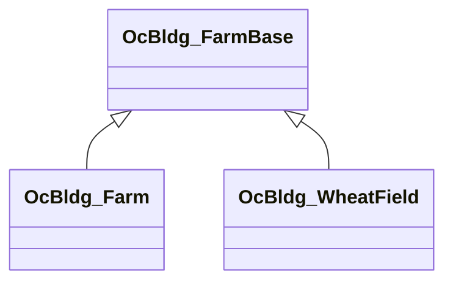

OcBldg_FarmBase 派生
==========================

下記表は[TestUtility](../TestUtility/README.md)を使用して抽出しています。

| 名前空間 | クラス     | 基本クラス   |       |  
|----------|------------|--------------|-------|  
| Oc | OcBldg_Farm  |     |   |  
| Oc | OcBldg_FarmBase  | OcBuildingBase_Craft    | abstract  |  
| Oc | OcBldg_WheatField  |     |   |  

