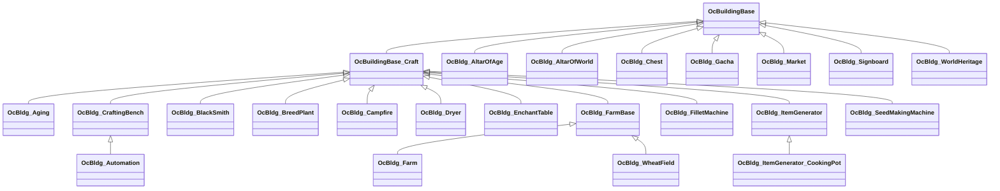

OcBuildingBase 派生
============================

下記表は[TestUtility](../TestUtility/README.md)を使用して抽出しています。

| 名前空間 | クラス     | 基本クラス   |       |  
|----------|------------|--------------|-------|  
| Oc | OcBldg_Aging  | OcBuildingBase_Craft    |   |  
| Oc | OcBldg_AltarOfAge  |     |   |  
| Oc | OcBldg_AltarOfWorld  |     |   |  
| Oc | OcBldg_Automation  | OcBldg_CraftingBench    |   |  
| Oc | OcBldg_BlackSmith  | OcBuildingBase_Craft    |   |  
| Oc | OcBldg_BreedPlant  | OcBuildingBase_Craft    |   |  
| Oc | OcBldg_Campfire  | OcBuildingBase_Craft    |   |  
| Oc | OcBldg_Chest  |     |   |  
| Oc | OcBldg_CraftingBench  | OcBuildingBase_Craft    |   |  
| Oc | OcBldg_Dryer  | OcBuildingBase_Craft    |   |  
| Oc | OcBldg_EnchantTable  | OcBuildingBase_Craft    |   |  
| Oc | OcBldg_Farm  | OcBldg_FarmBase    |   |  
| Oc | OcBldg_FarmBase  | OcBuildingBase_Craft    | abstract  |  
| Oc | OcBldg_FilletMachine  | OcBuildingBase_Craft    |   |  
| Oc | OcBldg_Gacha  |     |   |  
| Oc | OcBldg_ItemGenerator  | OcBuildingBase_Craft    |   |  
| Oc | OcBldg_ItemGenerator_CookingPot  | OcBldg_ItemGenerator    |   |  
| Oc | OcBldg_Market  |     |   |  
| Oc | OcBldg_SeedMakingMachine  | OcBuildingBase_Craft    |   |  
| Oc | OcBldg_Signboard  |     |   |  
| Oc | OcBldg_WheatField  | OcBldg_FarmBase    |   |  
| Oc | OcBldg_WorldHeritage  |     |   |  
| Oc | OcBuildingBase  | OcInstallObj    | abstract  |  
| Oc | OcBuildingBase_Craft  |     | abstract  |  

