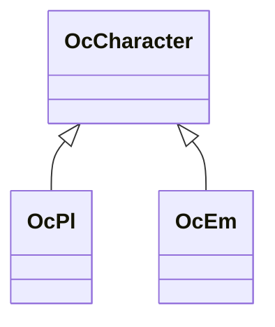

OcCharacter 派生
=============================

プレイヤーもエネミー(NPC含む)も `OcCharacter` 派生。

下記表は[TestUtility](../TestUtility/README.md)を使用して抽出しています。

| 名前空間 | クラス     | 基本クラス   |       |  
|----------|------------|--------------|-------|  
| Oc | OcCharacter  | MonoBehaviour    | abstract  |  
| Oc | OcPl  |     | abstract  |  
| Oc.Em | OcEm  |     | abstract  |  

