OcEm
=======================

`Em` は `Enemy` ?  

大本は、[OcCharacter](OcCharacter.md)  
NPC([OcEm_NPC_Base](OcEm_NPC_Base.md))もOcEm派生に含まれています。

`OcEmType` に列挙型も用意されている

下記表は[TestUtility](../TestUtility/README.md)を使用して抽出しています。

| 名前空間 | クラス     | 基本クラス   |       |  
|----------|------------|--------------|-------|  
| Oc.Em | `OcEm`  | `OcCharacter`    | abstract  |  
| Oc.Em | `OcEm_Barrel`  |     |   |  
| Oc.Em | `OcEm_Bat`  |     |   |  
| Oc.Em | `OcEm_Bear`  |     |   |  
| Oc.Em | `OcEm_Bird`  |     |   |  
| Oc.Em | `OcEm_Boar`  |     |   |  
| Oc.Em | `OcEm_Buffalo`  |     |   |  
| Oc.Em | `OcEm_Camel`  |     |   |  
| Oc.Em | `OcEm_Chicken`  |     |   |  
| Oc.Em | `OcEm_Cow`  |     |   |  
| Oc.Em | `OcEm_Crocodile`  |     |   |  
| Oc.Em | `OcEm_Dragon`  |     |   |  
| Oc.Em | `OcEm_Elephant`  |     |   |  
| Oc.Em | `OcEm_FrameWalker`  |     |   |  
| Oc.Em | `OcEm_Giraffe`  |     |   |  
| Oc.Em | `OcEm_GoblinBird`  |     |   |  
| Oc.Em | `OcEm_GoblinHunter`  |     |   |  
| Oc.Em | `OcEm_GoblinSharman`  |     |   |  
| Oc.Em | `OcEm_GoblinWarrior`  |     |   |  
| Oc.Em | `OcEm_GolemAncient`  |     |   |  
| Oc.Em | `OcEm_GolemStone`  |     |   |  
| Oc.Em | `OcEm_Gorilla`  |     |   |  
| Oc.Em | `OcEm_LizardExecutioner`  |     |   |  
| Oc.Em | `OcEm_Lizardman`  |     |   |  
| Oc.Em | `OcEm_LoneWolf`  |     |   |  
| Oc.Em | `OcEm_Lumberjack`  |     |   |  
| Oc.Em | `OcEm_Mono`  |     |   |  
| Oc.Em | `OcEm_NPC_Base`  |     | abstract  |  
| Oc.Em | `OcEm_NightQueen`  |     |   |  
| Oc.Em | `OcEm_PvMonster`  |     |   |  
| Oc.Em | `OcEm_Reaper`  |     |   |  
| Oc.Em | `OcEm_Ride`  |     |   |  
| Oc.Em | `OcEm_Slime`  |     |   |  
| Oc.Em | `OcEm_Werewolf`  |     |   |  

```mermaid
classDiagram

	class OcEm{
	}


	OcEm <|-- OcEm_Barrel
	class OcEm_Barrel{
	}


	OcEm <|-- OcEm_Bat
	class OcEm_Bat{
	}


	OcEm <|-- OcEm_Bear
	class OcEm_Bear{
	}


	OcEm <|-- OcEm_Bird
	class OcEm_Bird{
	}


	OcEm <|-- OcEm_Boar
	class OcEm_Boar{
	}


	OcEm <|-- OcEm_Buffalo
	class OcEm_Buffalo{
	}


	OcEm <|-- OcEm_Camel
	class OcEm_Camel{
	}


	OcEm <|-- OcEm_Chicken
	class OcEm_Chicken{
	}


	OcEm <|-- OcEm_Cow
	class OcEm_Cow{
	}


	OcEm <|-- OcEm_Crocodile
	class OcEm_Crocodile{
	}


	OcEm <|-- OcEm_Dragon
	class OcEm_Dragon{
	}


	OcEm <|-- OcEm_Elephant
	class OcEm_Elephant{
	}


	OcEm <|-- OcEm_FrameWalker
	class OcEm_FrameWalker{
	}


	OcEm <|-- OcEm_Giraffe
	class OcEm_Giraffe{
	}


	OcEm <|-- OcEm_GoblinBird
	class OcEm_GoblinBird{
	}


	OcEm <|-- OcEm_GoblinHunter
	class OcEm_GoblinHunter{
	}


	OcEm <|-- OcEm_GoblinSharman
	class OcEm_GoblinSharman{
	}


	OcEm <|-- OcEm_GoblinWarrior
	class OcEm_GoblinWarrior{
	}


	OcEm <|-- OcEm_GolemAncient
	class OcEm_GolemAncient{
	}


	OcEm <|-- OcEm_GolemStone
	class OcEm_GolemStone{
	}


	OcEm <|-- OcEm_Gorilla
	class OcEm_Gorilla{
	}


	OcEm <|-- OcEm_LizardExecutioner
	class OcEm_LizardExecutioner{
	}


	OcEm <|-- OcEm_Lizardman
	class OcEm_Lizardman{
	}


	OcEm <|-- OcEm_LoneWolf
	class OcEm_LoneWolf{
	}


	OcEm <|-- OcEm_Lumberjack
	class OcEm_Lumberjack{
	}


	OcEm <|-- OcEm_Mono
	class OcEm_Mono{
	}


	OcEm <|-- OcEm_NPC_Base
	class OcEm_NPC_Base{
	}


	OcEm <|-- OcEm_NightQueen
	class OcEm_NightQueen{
	}


	OcEm <|-- OcEm_PvMonster
	class OcEm_PvMonster{
	}


	OcEm <|-- OcEm_Reaper
	class OcEm_Reaper{
	}


	OcEm <|-- OcEm_Ride
	class OcEm_Ride{
	}


	OcEm <|-- OcEm_Slime
	class OcEm_Slime{
	}


	OcEm <|-- OcEm_Werewolf
	class OcEm_Werewolf{
	}

```

