`Em` は `Enemy` ?  

大本は、[OcCharacter](OcCharacter.md)  
NPCも含みます。  

下記表は[TestUtility](../TestUtility/README.md)を使用して抽出しています。

| 名前空間 | クラス     | 基本クラス   |       |  
|----------|------------|--------------|-------|  
| Oc.Em | OcEm  | OcCharacter    | abstract  |  
| Oc.Em | OcEm_Barrel  |     |   |  
| Oc.Em | OcEm_Bat  |     |   |  
| Oc.Em | OcEm_Bear  |     |   |  
| Oc.Em | OcEm_Bird  |     |   |  
| Oc.Em | OcEm_Boar  |     |   |  
| Oc.Em | OcEm_Buffalo  |     |   |  
| Oc.Em | OcEm_Camel  |     |   |  
| Oc.Em | OcEm_Chicken  |     |   |  
| Oc.Em | OcEm_Cow  |     |   |  
| Oc.Em | OcEm_Crocodile  |     |   |  
| Oc.Em | OcEm_Dragon  |     |   |  
| Oc.Em | OcEm_Elephant  |     |   |  
| Oc.Em | OcEm_FrameWalker  |     |   |  
| Oc.Em | OcEm_Giraffe  |     |   |  
| Oc.Em | OcEm_GoblinBird  |     |   |  
| Oc.Em | OcEm_GoblinHunter  |     |   |  
| Oc.Em | OcEm_GoblinSharman  |     |   |  
| Oc.Em | OcEm_GoblinWarrior  |     |   |  
| Oc.Em | OcEm_GolemAncient  |     |   |  
| Oc.Em | OcEm_GolemStone  |     |   |  
| Oc.Em | OcEm_Gorilla  |     |   |  
| Oc.Em | OcEm_Lizardman  |     |   |  
| Oc.Em | OcEm_LoneWolf  |     |   |  
| Oc.Em | OcEm_Lumberjack  |     |   |  
| Oc.Em | OcEm_Mono  |     |   |  
| Oc.Em | OcEm_NPC_Bandit  | OcEm_NPC_Base    |   |  
| Oc.Em | OcEm_NPC_Base  |     | abstract  |  
| Oc.Em | OcEm_NPC_ChestBase  | OcEm_NPC_Base    | abstract  |  
| Oc.Em | OcEm_NPC_Event  | OcEm_NPC_ChestBase    |   |  
| Oc.Em | OcEm_NPC_Merchant  | OcEm_NPC_ChestBase    |   |  
| Oc.Em | OcEm_NPC_Mob  | OcEm_NPC_Base    |   |  
| Oc.Em | OcEm_NPC_Mob_Anubis  | OcEm_NPC_Mob    |   |  
| Oc.Em | OcEm_NPC_Reception  | OcEm_NPC_Base    |   |  
| Oc.Em | OcEm_NightQueen  |     |   |  
| Oc.Em | OcEm_PvMonster  |     |   |  
| Oc.Em | OcEm_Ride  |     |   |  
| Oc.Em | OcEm_Slime  |     |   |  

```mermaid
classDiagram

	class OcEm{
	}


	OcEm <|-- OcEm_Barrel
	class OcEm_Barrel{
	}


	OcEm <|-- OcEm_Bat
	class OcEm_Bat{
	}


	OcEm <|-- OcEm_Bear
	class OcEm_Bear{
	}


	OcEm <|-- OcEm_Bird
	class OcEm_Bird{
	}


	OcEm <|-- OcEm_Boar
	class OcEm_Boar{
	}


	OcEm <|-- OcEm_Buffalo
	class OcEm_Buffalo{
	}


	OcEm <|-- OcEm_Camel
	class OcEm_Camel{
	}


	OcEm <|-- OcEm_Chicken
	class OcEm_Chicken{
	}


	OcEm <|-- OcEm_Cow
	class OcEm_Cow{
	}


	OcEm <|-- OcEm_Crocodile
	class OcEm_Crocodile{
	}


	OcEm <|-- OcEm_Dragon
	class OcEm_Dragon{
	}


	OcEm <|-- OcEm_Elephant
	class OcEm_Elephant{
	}


	OcEm <|-- OcEm_FrameWalker
	class OcEm_FrameWalker{
	}


	OcEm <|-- OcEm_Giraffe
	class OcEm_Giraffe{
	}


	OcEm <|-- OcEm_GoblinBird
	class OcEm_GoblinBird{
	}


	OcEm <|-- OcEm_GoblinHunter
	class OcEm_GoblinHunter{
	}


	OcEm <|-- OcEm_GoblinSharman
	class OcEm_GoblinSharman{
	}


	OcEm <|-- OcEm_GoblinWarrior
	class OcEm_GoblinWarrior{
	}


	OcEm <|-- OcEm_GolemAncient
	class OcEm_GolemAncient{
	}


	OcEm <|-- OcEm_GolemStone
	class OcEm_GolemStone{
	}


	OcEm <|-- OcEm_Gorilla
	class OcEm_Gorilla{
	}


	OcEm <|-- OcEm_Lizardman
	class OcEm_Lizardman{
	}


	OcEm <|-- OcEm_LoneWolf
	class OcEm_LoneWolf{
	}


	OcEm <|-- OcEm_Lumberjack
	class OcEm_Lumberjack{
	}


	OcEm <|-- OcEm_Mono
	class OcEm_Mono{
	}


	OcEm_NPC_Base <|-- OcEm_NPC_Bandit
	class OcEm_NPC_Bandit{
	}


	OcEm <|-- OcEm_NPC_Base
	class OcEm_NPC_Base{
	}


	OcEm_NPC_Base <|-- OcEm_NPC_ChestBase
	class OcEm_NPC_ChestBase{
	}


	OcEm_NPC_ChestBase <|-- OcEm_NPC_Event
	class OcEm_NPC_Event{
	}


	OcEm_NPC_ChestBase <|-- OcEm_NPC_Merchant
	class OcEm_NPC_Merchant{
	}


	OcEm_NPC_Base <|-- OcEm_NPC_Mob
	class OcEm_NPC_Mob{
	}


	OcEm_NPC_Mob <|-- OcEm_NPC_Mob_Anubis
	class OcEm_NPC_Mob_Anubis{
	}


	OcEm_NPC_Base <|-- OcEm_NPC_Reception
	class OcEm_NPC_Reception{
	}


	OcEm <|-- OcEm_NightQueen
	class OcEm_NightQueen{
	}


	OcEm <|-- OcEm_PvMonster
	class OcEm_PvMonster{
	}


	OcEm <|-- OcEm_Ride
	class OcEm_Ride{
	}


	OcEm <|-- OcEm_Slime
	class OcEm_Slime{
	}

```

