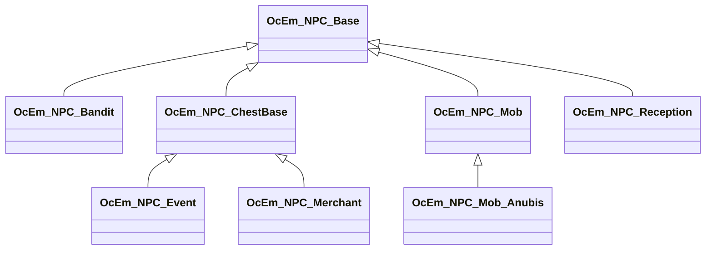

OcEm_NPC_Base
===========================

[OcEm](OcEm.md)派生。
大本は、[OcCharacter](OcCharacter.md)  

`OcEmType` に列挙型も用意されている

下記表は[TestUtility](../TestUtility/README.md)を使用して抽出しています。

| 名前空間 | クラス     | 基本クラス   |       |  
|----------|------------|--------------|-------|  
| Oc.Em | `OcEm_NPC_Bandit`  |     |   |  
| Oc.Em | `OcEm_NPC_Base`  | `OcEm`    | abstract  |  
| Oc.Em | `OcEm_NPC_ChestBase`  |     | abstract  |  
| Oc.Em | `OcEm_NPC_Event`  | `OcEm_NPC_ChestBase`    |   |  
| Oc.Em | `OcEm_NPC_Merchant`  | `OcEm_NPC_ChestBase`    |   |  
| Oc.Em | `OcEm_NPC_Mob`  |     |   |  
| Oc.Em | `OcEm_NPC_Mob_Anubis`  | `OcEm_NPC_Mob`    |   |  
| Oc.Em | `OcEm_NPC_Reception`  |     |   |  

