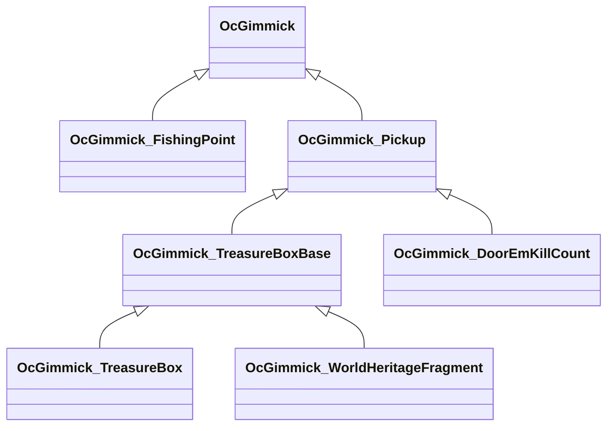

OcGimmick 派生クラス
============================

下記表は[TestUtility](../TestUtility/README.md)を使用して抽出しています。

| 名前空間 | クラス     | 基本クラス   |       |  
|----------|------------|--------------|-------|  
| Oc | `OcGimmick`  | `MonoBehaviour`    | abstract  |  
| Oc | `OcGimmick_FishingPoint`  |     |   |  
| Oc | `OcGimmick_TreasureBox`  | `OcGimmick_TreasureBoxBase`    |   |  
| Oc | `OcGimmick_TreasureBoxBase`  | `OcGimmick_Pickup`    | abstract  |  
| Oc | `OcGimmick_WorldHeritageFragment`  | `OcGimmick_TreasureBoxBase`    |   |  
| Oc | `OcGimmick_DoorEmKillCount`  | `OcGimmick_Pickup`    |   |  
| Oc | `OcGimmick_Pickup`  |     |   |  

