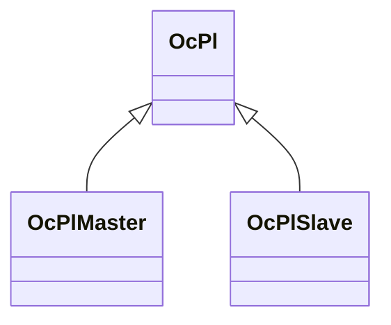

OcPl 派生
========================

`Pl` は `Player`  
大本は、[OcCharacter](OcCharacter.md)  

ローカルな自キャラが `OcPlMaster` となります。  

下記表は[TestUtility](../TestUtility/README.md)を使用して抽出しています。  

| 名前空間 | クラス     | 基本クラス   |       |  
|----------|------------|--------------|-------|  
| Oc | OcPl  | OcCharacter    | abstract  |  
| Oc | OcPlMaster  |     |   |  
| Oc | OcPlSlave  |     |   |  

