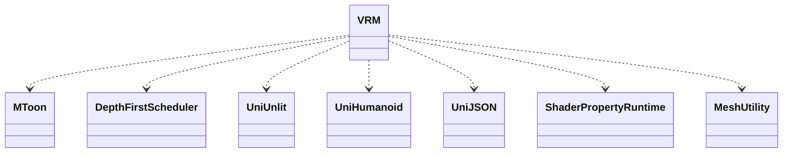

VRM
===========================

## DLL
UnityでUniVRMを導入してビルドすることで生成されるファイルを使用

* VRM.dll
* MToon.dll
* DepthFirstScheduler.dll
* UniUnlit.dll
* UniHumanoid.dll
* UniJSON.dll
* ShaderProperty.Runtime.dll
* MeshUtility.dll

## UniVRM
https://vrm.dev/docs/univrm/

